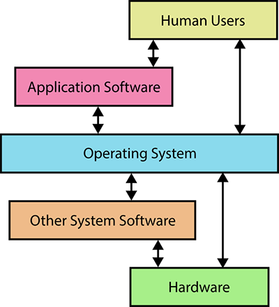

# Introduction to the course and initial setup

Welcome to the Computational Background Skills class! We will use these markdown documents to give you links and other things that it would be difficult to copy by hand. You, the students, may use it to come back to what we learned and review if needed.

## Agenda (90m session)
* [Introducing the lecturers (5m)](#introducing-the-lecturers)
* [Aims and contents of the course (10m)](#aims-and-contents-of-the-course)
* [Required Setup and Tools (30m)](#required-setup-and-tools)
* [Getting to know your OS (40m)](#getting-to-know-your-OS)

## Introducing the lecturer
Tara L. Andrews (tara.andrews@univie.ac.at)  

Please don't hesitate to reach out if you need any help about the lecture.

## Aims and contents of the course
This course is intended to provide basic training and support for further skills courses in the Digital Humanities. It is strongly recommended as a prerequisite to the other DH practical courses.
As such, students will be required to bring a laptop computer (no tablets!) If this presents a problem, please contact one of the course instructors in advance.

We will also try to accompany the contents of each course with some practical steps of the exercise, which will lead to a final project in the end.

### Grading & Attendance
Attendance in every lecture is required due to the PI type of block-course.

Regular attendance, following the practical exercise tasks during the lecture and active participation will count toward your final grade.

## Required Setup and Tools

Create a personal GitHub account if you don't already have one: https://github.com/join

We will do the installation in small groups of 3 or 4. As you run through each installer, read the information you are being given and discuss among yourselves what you think it means! The object is to recognise what you don't understand, and notice the choices that the installer makes by "default" on your behalf.

- Get the practice data from here: http://swcarpentry.github.io/shell-novice/data/data-shell.zip and unzip it. We strongly recommend that you unzip it on your Desktop.
- Download and install the Atom code editor: https://atom.io/
- (**WINDOWS ONLY**) Download and install Git SCM (including Git Bash): https://gitforwindows.org/. The installer will ask you a lot of questions! For most of these, it is fine to accept the default; when you are asked what Git's default editor should be, choose Atom.
- (**MAC ONLY**) Run the command `xcode-select --install` to install Git and some other useful command line utilities. You will need to make Atom Git's default editor; after Git is installed, you can do this with the command `git config --global core.editor "atom"`.

## Getting to know your OS

Operating systems are system software which manage computer hardware and software resources. They provide common services for computer programs and interfaces for humans to interact with.

The most common current operating systems are:  
Windows (Microsoft)  
macOS (Apple)  
Linux (Linux community, open-source: RedHat, Ubuntu, Debian, etc.)  
Mobile: Android (Google, based on the Linux kernel)  
Mobile: iOS (Apple)  

## File system hierarchy

* What are files?
* What are directories/folders? <!-- Directories are a special kind of file.
Thinking about why we call them folders: a folder and a piece of paper are the same, and can do some of the same things. A folder can also hold pieces of paper.-->
* What are programs? <!--Programs are files that can do something, but are still files nonetheless. Take a piece of paper out of your folder, fold it into an airplane, and throw it. It's still a piece of paper you can read from and write on, but it can fly.-->
* GUI file explorers and file hierarchy

## About files

* Why are some files hidden? <!--If you change something, however small, in some of these files, you can break your computer. Be careful! -->
* **Case sensitive** vs **case preserving**: Linux is **case sensitive**, meaning files with the same name but different capitalization are different files (e.g., `finalpaper.txt` is different than `FinalPaper.txt`). Mac OS and Windows are **case preserving**, but not case sensitive. <!-- (This preference can be changed when configuring the filesystem, but certain programs will not run in a case sensitive environment, so it’s best to leave it alone). A case preserving file system will spell the filename as you type it, but if you create a different file with a name that differs only in capitalization, it will overwrite the first one. We recommend not creating filenames that differ only in capitalization even on Linux; not only is it potentially confusing, but you may be collaborating on a project with someone not on Linux. -->
* **Spaces** in a file and directory names. Why could these be problematic?

## Navigating your filesystem

Please follow along in the separate guides for [Mac](os_mac.md) and [Windows](os_windows.md).

## Next session

After the lunch break we will run parallel sessions for Mac and Windows users. Please make sure you are in the appropriate group!
